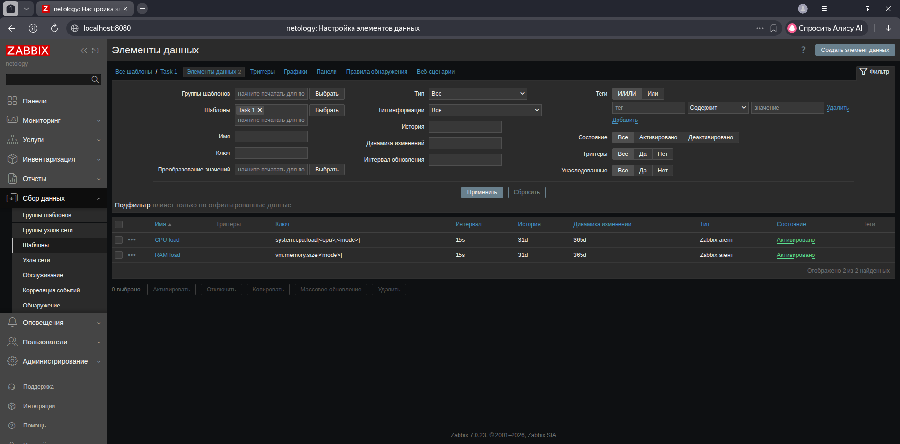
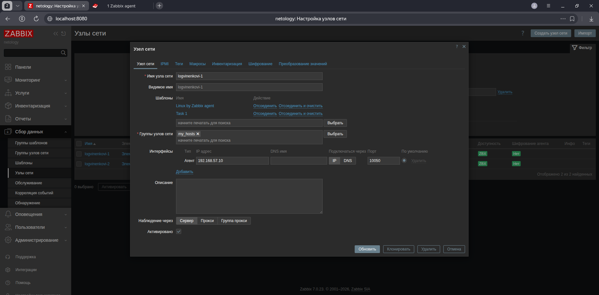
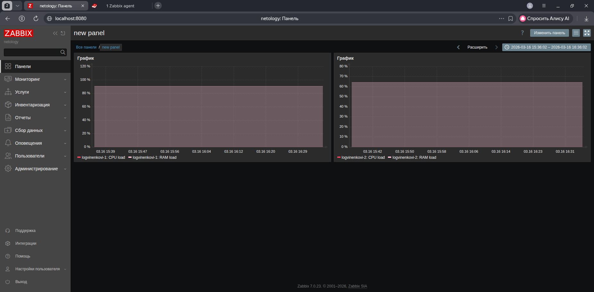
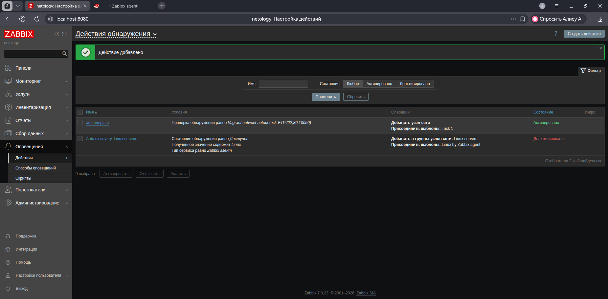

### Задание 1

Создайте свой шаблон, в котором будут элементы данных, мониторящие загрузку CPU и RAM хоста.

#### Результат

- [x] Прикрепите в файл README.md скриншот страницы шаблона с названием «Задание 1»

---

### Задание 2

Добавьте в Zabbix два хоста и задайте им имена <фамилия и инициалы-1> и <фамилия и инициалы-2>. Например: ivanovii-1 и ivanovii-2.

#### Результат

- [x] Результат данного задания сдавайте вместе с заданием 3

### Задание 3

Привяжите созданный шаблон к двум хостам. Также привяжите к обоим хостам шаблон Linux by Zabbix Agent.

#### Результат

.png)
---

### Задание 4

Создайте свой кастомный дашборд.

#### Процесс выполнения

1. Выполняя ДЗ сверяйтесь с процессом отражённым в записи лекции.
2. В разделе Dashboards создайте новый дашборд
3. Разместите на нём несколько графиков на ваше усмотрение.

#### Результат

- [x] Прикрепите в файл README.md скриншот дашборда с названием «Задание 4»

 ---

### Задание 8* со звёздочкой

Настройте автообнаружение и прикрепление к хостам созданного вами ранее шаблона.

#### Результат

- [x] Прикрепите в файл README.md скриншот правила обнаружения, а также скриншот страницы Discover, где видны оба хоста.*

.png)

**Уточнение:** автообнаружение или автодобавление?
 ---